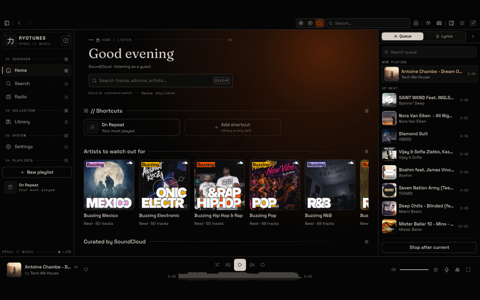
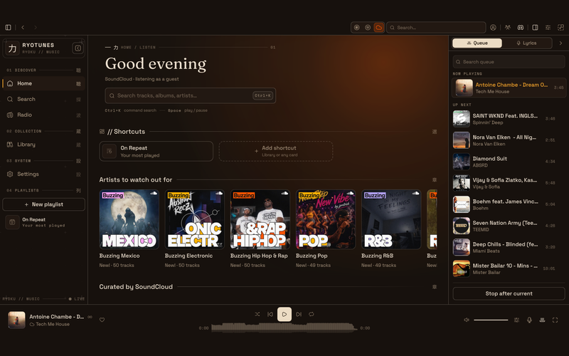
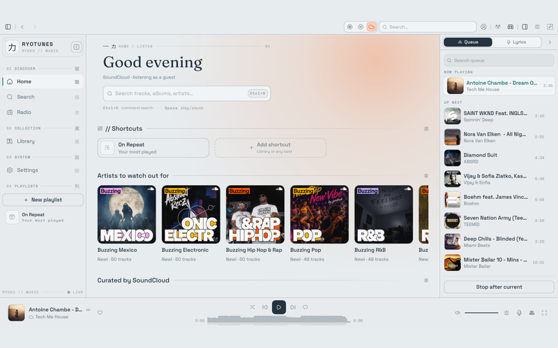

# Ryotunes skins

A skin is one `skin.json` that recolours Ryotunes — eight colours per mode, plus type, shape,
motion, decor, accent and wash. Pick one in Settings; editing its file re-paints the running app
live.

- **Format reference:** [`docs/SKINS.md`](../docs/SKINS.md) — every key, the resolution order,
  live reload, the `system` skin, and matugen.
- **Schema:** [`skin.schema.json`](skin.schema.json) — reference it with
  `"$schema": "../skin.schema.json"`.
- **Validate:** `ryotunes-cli skin check skins/<id>` (also `skin list`, `skin show <id>`).
- **Preview:** `scripts/dev/skin-preview.sh <id>` writes `skins/<id>/preview.png` (800×500).

## Shipped skins

| Skin | Preview | Modes | Description |
| --- | --- | --- | --- |
| **Paper** |  | dark · light | Ryotunes' own: pure-black paper, warm bone ink, one red sun. The palette every other skin falls back to. |
| **Ember** |  | dark · light | Warm dark: deep-umber paper, warm bone ink, one amber sun. Firelit and rich; the accent follows the sun. |
| **Mist** |  | light · dark | Light-first: fog paper, slate-navy ink, a quiet teal sun. Calm and flat, with a matching dark mode. |

## Contributing

Fork from Settings or copy `paper/`, edit, `ryotunes-cli skin check`, capture a preview, open a PR
into `skins/<id>/`. Full checklist — license (CC0/MIT), no proprietary fonts, 800×500 preview — is
in [`docs/SKINS.md`](../docs/SKINS.md#submitting-a-skin).
