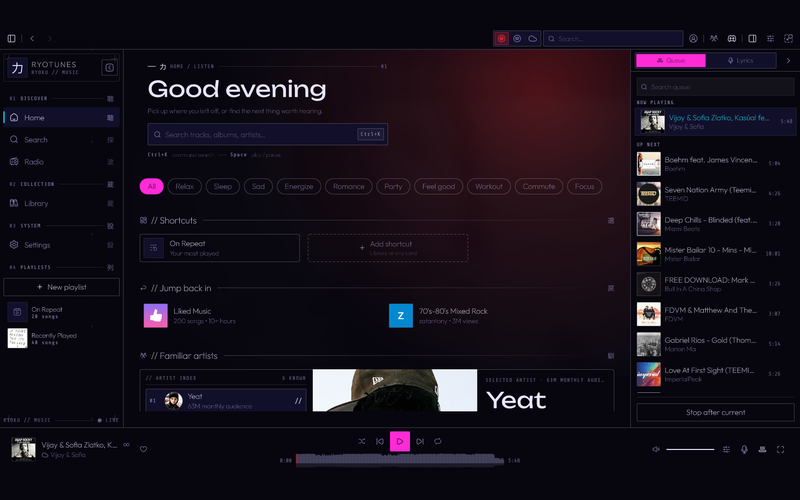
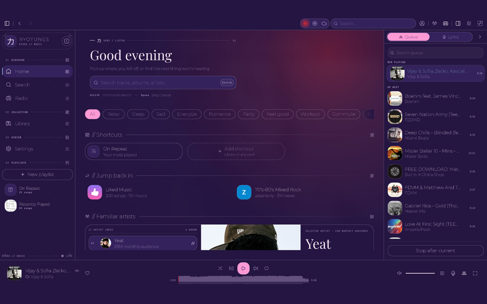
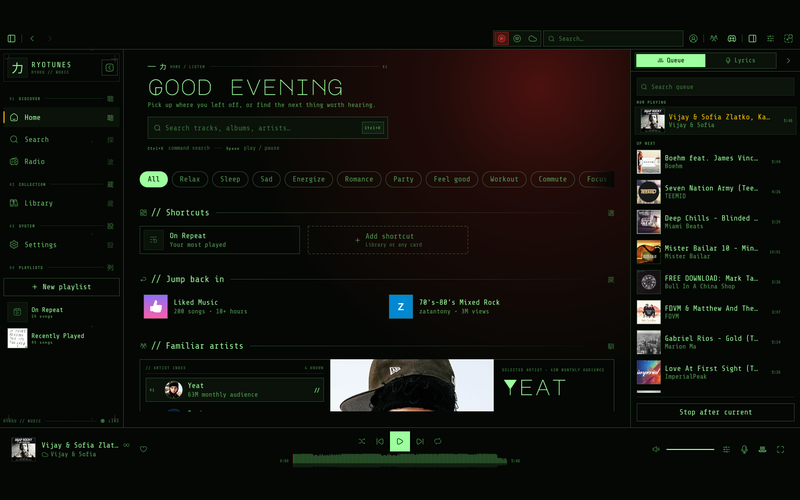
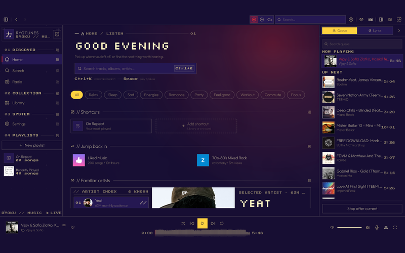
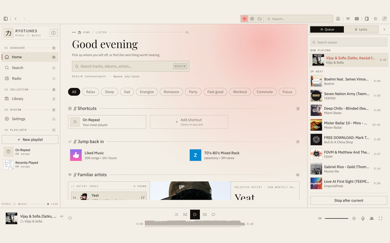
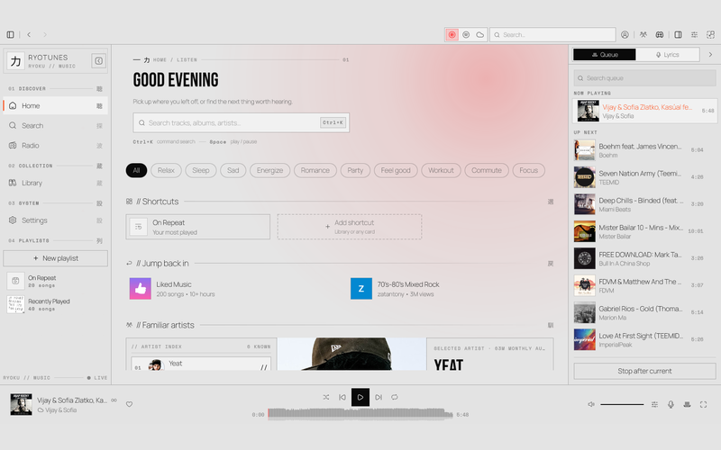
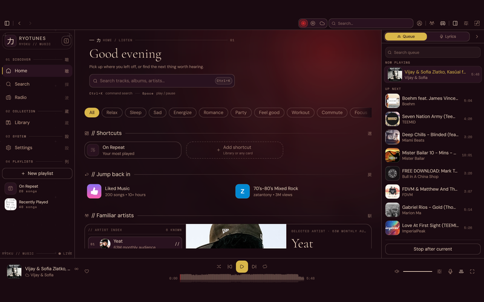

# Ryotunes skins

A skin is one `skin.json` that recolours Ryotunes — eight colours per mode, plus type, shape,
motion, decor, accent and wash. Pick one in Settings; editing its file re-paints the running app
live.

- **Format reference:** [`docs/SKINS.md`](../docs/SKINS.md) — every key, the resolution order,
  live reload, the `system` skin, and matugen.
- **Schema:** [`skin.schema.json`](skin.schema.json) — reference it with
  `"$schema": "../skin.schema.json"`.
- **Validate:** `ryotunes-cli skin check skins/<id>` (also `skin list`, `skin show <id>`).
- **Preview:** `scripts/dev/skin-preview.sh <id>` writes `skins/<id>/preview.png` (800×500).

## Shipped skins

| Skin | Preview | Modes | Description |
| --- | --- | --- | --- |
| **Paper** |  | dark · light | Ryotunes' own: pure-black paper, warm bone ink, one red sun. The palette every other skin falls back to. |
| **Ember** |  | dark · light | Warm dark: deep-umber paper, warm bone ink, one amber sun. Firelit and rich; the accent follows the sun. |
| **Mist** |  | light · dark | Light-first: fog paper, slate-navy ink, a quiet teal sun. Calm and flat, with a matching dark mode. |
| **Neon** |  | dark | Tokyo after midnight: ink-blue paper, hot magenta bone, a cyan sun. Unbounded titles, sharp corners, fast motion, the cover wash turned up. Bundled OFL faces: Unbounded · Outfit · Share Tech Mono. |
| **Vapor** |  | dark | Vaporwave: violet paper, pink bone, a teal sun, Playfair titles and VT323 readouts, round corners, slow motion, the cover melting over everything. Bundled OFL faces: Playfair Display · Montserrat · VT323. |
| **Phosphor** |  | dark | A green-phosphor terminal: black glass, P1 green ink, an amber sun, Major Mono titles, square corners, instant motion, no wash. Bundled OFL faces: Major Mono Display · Share Tech Mono · VT323. |
| **Arcade** |  | dark | 8-bit cabinet: indigo paper, coin-yellow bone, a pink sun, Silkscreen titles and Press Start readouts, no corners, the provider's colour as the light. Bundled OFL faces: Silkscreen · Outfit · Press Start 2P. |
| **Broadsheet** |  | light · dark | Newsprint: warm off-white paper, black ink, one deep-red sun, Playfair titles over IBM Plex, hairline corners, almost no wash. Dark edition inside. Bundled OFL faces: Playfair Display · IBM Plex Sans · Space Mono. |
| **Concrete** |  | light · dark | Brutalist: grey slab, black ink, safety-orange everything that matters, Bebas Neue titles, zero radius, zero wash, motion cut to the bone. Bundled OFL faces: Bebas Neue · Manrope · Space Mono. |
| **Velvet** |  | dark | A lounge at closing time: wine-dark paper, gilt bone and sun, Cormorant titles over DM Sans, soft corners, slow motion, the cover glowing through. Bundled OFL faces: Cormorant Garamond · DM Sans · Space Mono. |

## Contributing

Fork from Settings or copy `paper/`, edit, `ryotunes-cli skin check`, capture a preview, open a PR
into `skins/<id>/`. Full checklist — license (CC0/MIT), no proprietary fonts, 800×500 preview — is
in [`docs/SKINS.md`](../docs/SKINS.md#submitting-a-skin).
